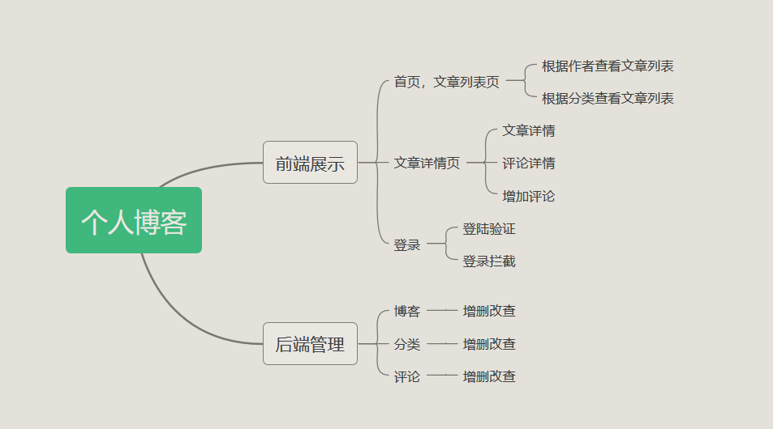
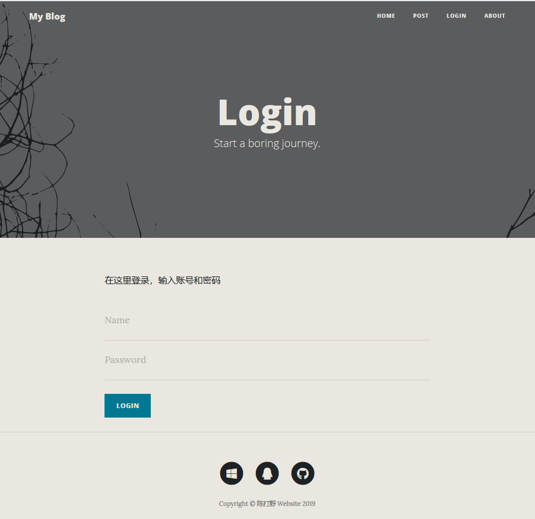
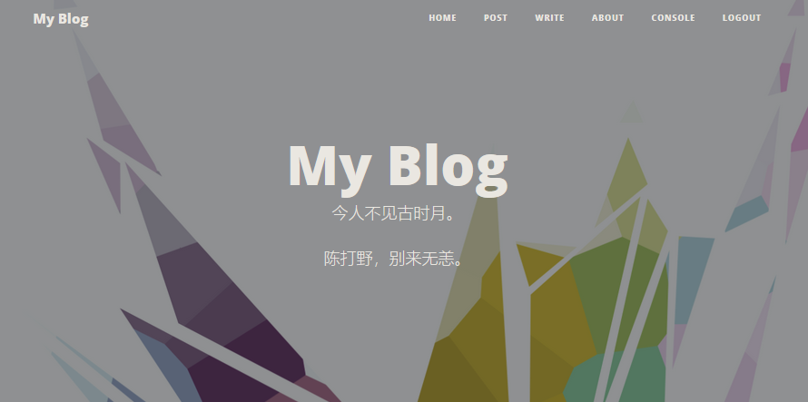

# Blog
##### 基于Spring Boot的个人博客 Spring Boot+Spring Data JPA+Thymeleaf+Bootstrap+MySql

------

##### 还需完善：

- 异常处理，包括弹窗提示错误等；
- 利用评论的自关联实现评论回复的二级目录；
- 后台界面不响应手机端；
- 用户管理；

##### 未来需要改正：

- 从方法的命名到对象的调用，面向对象的继承实现关系，都有缺陷，需仔细阅读阿里巴巴开发手册加以改正；

博客演示地址：[182.92.166.144:8080]()

